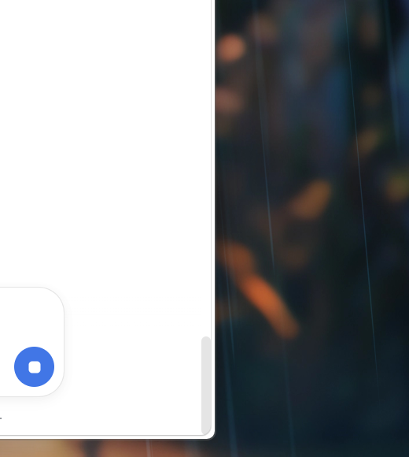

# 小铃铛桌宠（Xiao Ling Dang Desktop Pet）

一个 Windows 桌面宠物：透明置顶、可拖动、能聊天、会说话、有情绪表情。基于开源项目 [dsh-pet-indesktop](https://github.com/MerZlin/dsh-pet-indesktop) 二次开发，接入了「小铃铛」AI 人格与情绪表情、口型同步、统一设置界面。

## 截图



## 特性

- 🐳 透明置顶桌宠，可拖动、可缩放、鼠标穿透
- 💬 AI 对话（OpenAI 兼容接口，可接任意大模型：DeepSeek / 通义千问 / 本地 Ollama …）
- 🔊 语音朗读（edge-tts，免费），说话时嘴巴动（口型同步）
- 😄 情绪表情：回复时按情绪播放对应动画，可在设置里自己改映射
- 🎭 换角色：自定义角色素材，放目录即用
- ⚙️ 统一设置界面：AI 模型 / 语音 / 情绪表情 一个窗口搞定

## 环境要求

- Windows 10 / 11
- Python 3.10 ~ 3.14
- 有网络（首次装依赖、AI 对话、语音合成都需要联网）

## 快速开始（Windows）

### 1. 安装依赖

双击 `install.bat`（自动创建虚拟环境并安装依赖），或手动：

```bash
python -m venv .venv
.venv\Scripts\python.exe -m pip install -r requirements.txt
```

### 2. 启动

双击 `run.bat`，或：

```bash
.venv\Scripts\python.exe -m pet
```

桌宠会出现在桌面右下角。右键它 → 「AI 对话」打开聊天窗口，或右键 → 「设置」配置 AI。

### 3. 配置 AI（第一次用必须填）

右键桌宠 → 「设置」→「AI 模型」标签页，填：

| 项 | 示例 |
|----|------|
| API 地址 | `https://api.deepseek.com/v1` |
| 模型 | `deepseek-chat` |
| API Key | 你自己的 key（**只存本地，不上传**）|

点「测试连接」通了，保存即可。**不填 key 也能看动画，但没有 AI 回复。**

> 兼容任何 OpenAI 格式的接口：DeepSeek、通义千问(dashscope)、Ollama(localhost:11434)、OpenAI 等，换 base_url + model + key 即可。

## 功能说明

### 情绪表情映射

AI 回复末尾会带情绪标签（`<开心>` 这种），桌宠据此播放动画；AI 没带标签时会按回复关键词自动判断情绪兜底。

在「设置 → 情绪表情」里，可以把每种情绪（开心/生气/惊讶/害羞/难过/思考/平静）改成任意动画（按大类分组：待机/移动/点击回应/随机动作）。

### 语音

「设置 → 语音」里换音色、语速、音调、音量。语音用 edge-tts（免费），语音播放期间桌宠会循环播放说话动画，读完自动回待机。

### 自定义角色（做你自己的小人）

准备透明背景的 WebM 动画（每段几秒），按分类放目录：

```
characters/我的角色/videos/
├── idle/待机.webm            # 待机
├── turn/转头.webm            # 转向
├── move/走路.webm            # 移动
├── click/点击开心.webm       # 点击回应
├── drag/拖拽.webm            # 拖拽（可选）
└── random/跳舞.webm          # 随机动作
```

放好后重启，右键桌宠 → 「切换角色」选你的角色即可。

> 动画素材可用 AI 视频工具生成（如可灵、即梦、Runway），提示词示例：`透明背景的卡通小人待机呼吸动画，正面全身，Q版，循环`。

## 目录结构

```
├── pet/                     # 核心代码
│   ├── app.py               # 应用入口（菜单/托盘）
│   ├── window.py            # 桌宠窗口、动画链、情绪/口型
│   ├── config.py            # 配置（AI/语音/情绪映射）
│   ├── unified_settings.py  # 统一设置界面
│   ├── chat/                # AI 对话子系统
│   │   ├── service.py       # 流式调用
│   │   ├── providers.py     # OpenAI 兼容接口
│   │   ├── speech.py        # TTS 语音 + 口型时长
│   │   └── widgets.py       # 聊天窗口
│   └── ...
├── assets/characters/       # 内置角色动画素材
├── install.bat              # 一键安装依赖
├── run.bat                  # 启动
└── requirements.txt         # 依赖清单
```

## 隐私说明

- API Key 只存在**本机系统 keyring** 和本地配置，**不会**出现在代码里，上传/分享不会泄露。
- 本仓库不含任何真实密钥。

## 许可

本项目基于 [dsh-pet-indesktop](https://github.com/MerZlin/dsh-pet-indesktop)（源自 [dsh-pet](https://github.com/PC2005-cloud/dsh-pet)）修改，请遵循其原始许可。动画素材版权归原作者所有。
